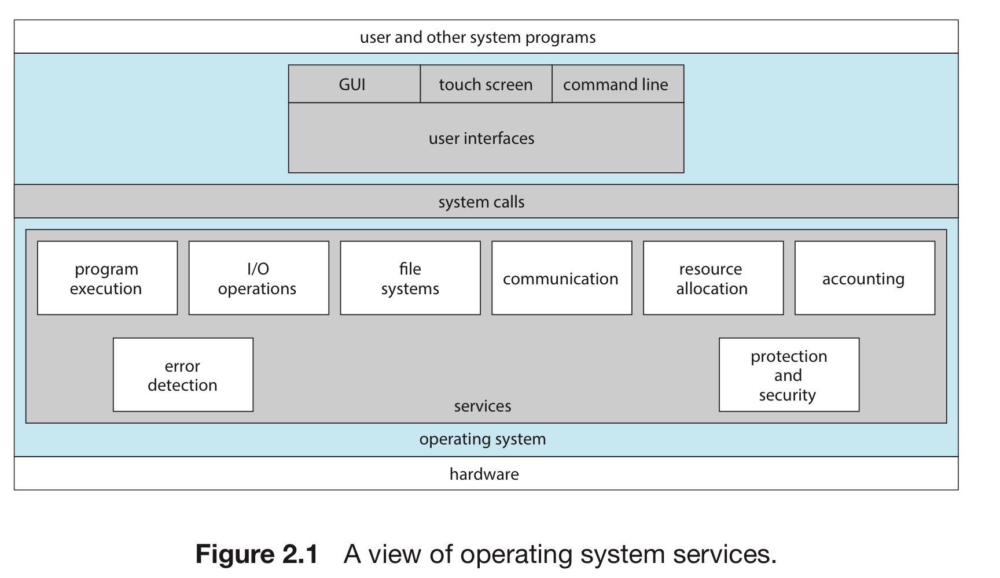

## Reading: Chapter 2.1 - 2.8, 2.10

### 1. OS Services (Section 2.1)
- These OS services make the programming task easier for the programmer

- User Interface (UI)
  - The Interface is a `window system` with a mouse that serves as a pointing device to direct I/O, choose from menus, and make selections and a keyboard to enter text
  - E.g. GUI, touch-screen interface, CLI(command-line interface)
- Program execution
  - The system must be able `to load` a program into memory and `to run` that program.
  - The program must be able `to end` its execution, either normally or abnormally (indicating error)
- I/O Operation
  - A running program may require I/O (reading from a network interface or writing to a file system)
  - Users cannot control I/O devices directly for efficiency and protection 
    - 看上去很严格，其实是为了效率和保护，如果不严格，每个人程序都有出错的可能
    - ==> the OS must provide a means to do I/O
- File-system manipulation
  - read, write, add, delete
- Communications
  - Exchange of information between

### 2. User and OS Interface (2.2)

### 3.
