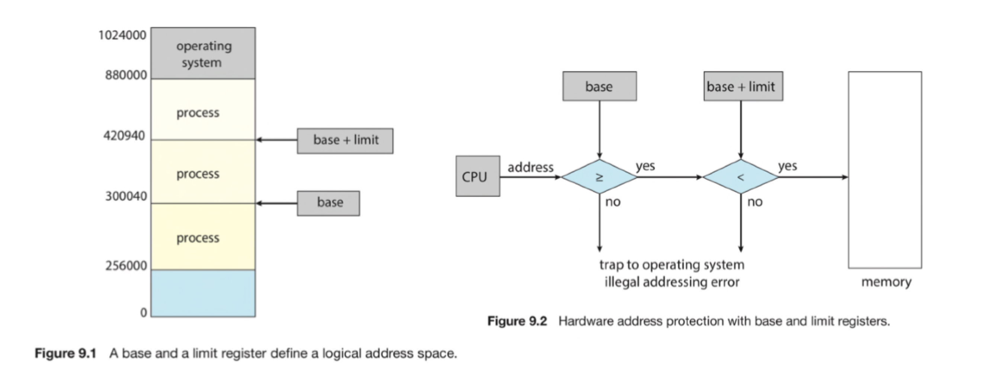
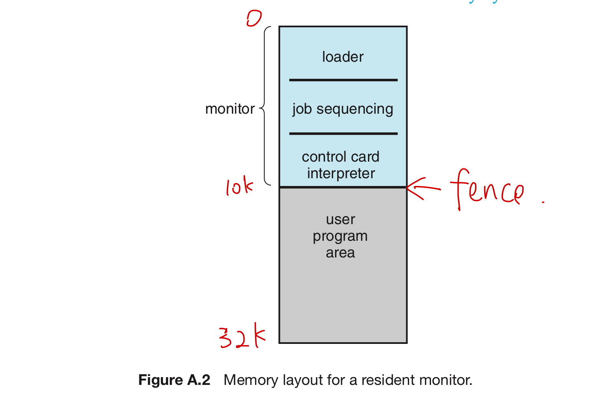
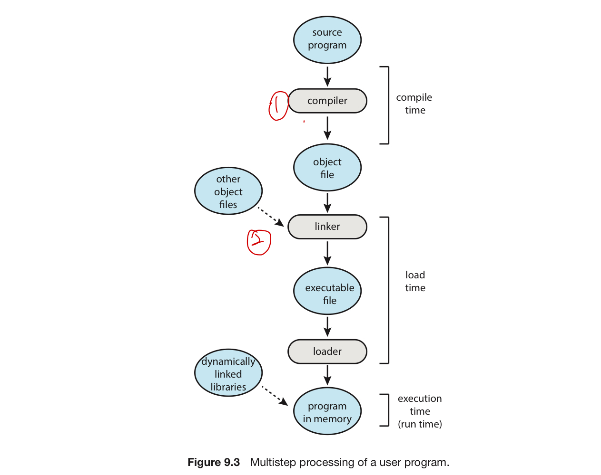

## Memory Management | Tues July 7 | Chapter 9.1 | 12 Pages 

### 1. Background (CMPT 295 - ISA & Cache)
Program must be brought (from disk) into memory and placed within a process for it to be run
- Main Memory and Registers are the only storage CPU can access directly
- Access time differs
  - Register access in one CPU clock cycle (or less)
  - Main Memory can take `many cycles`
    - Fetch -> Decode -> Calculate -> Memory -> Write Back
- Cache sits between main memory and CPU Registers for the larger gap between those two.
- Protection of memory required to ensure correct operation
### 2. Memory Management
Several Questions we can ask about our O/S:
- What Restrictions does the OS and hardware place on user(process) access to memory?
- What facilities are provided by the OS and hardware for memory?
- What protection is given by the Memory Management Scheme?
  - To make sure that each process has a `separate memory space`
    - Separate per-process memory space protects  the processes from each other and is fundamental to having multiple processes loaded in memory for concurrent execution
    - To separate memory spaces, need ability to decide 【the range of UNIQUE legal addresses】 that the process may ONLY access
  - By using two Registers loaded only by the OS in Kernel Mode which uses a special privileged instruction:
    - The Base Register: holds the **smallest legal physical** memory address (300040)
    - The Limit Register: specifies the size of the range (120900)
    - Then the program can legally access all addresses from 300040 through 420939 (inclusive)
    - Protection of memory space is accomplished by having the CPU hardware, compare every address generated in User Mode with the registers.
    - Any attempt by a program executing in User Mode to access Operating-system Memory or other users' memory ==> results in a trap to the OS, which treats the attempt as a fatal error (Figure 9.2)

  - This scheme allows the OS in Kernel Mode to change the value of the registers but prevents user programs from changing the registers' contents
####  Bare Machine - No Memory Management
- The application has `complete control` over all the memory in the machine
- No separate OS is present
- There is no protection of any memory location
  - The application process can write to any memory location
### 3. Resident Monitor（ Page5-6 | Appendix2.2）  
Memory is divided into 2 parts: 
- The Monitor (or operationg system)
- The User (or application)
Resident Monitor is a small program created to transfer control automatically from one job to the next. The Resident Monitor is always placed at the top or the bottom of memory.

We must have a way of protecting the operating system code from corruption
- Application may either maliciously or accidentally write into operating system space
Memory Protection can be implemented in hardware using a 【**fence**】
- A memory access by the user program on the OS side of the fence will generate a hardware trap
- Depending on the hardware, this can slow down the execution as each memory reference must be checked
This requires 2 modes of execution
- User Mode: Hardware checks all memory references
- Supervisor Mode: Hardware checks disabled
#### Problems with Resident Monitors
Early Monitors: the fence had to be built into the hardware
- The fence remained constant
- Constrained O/S size: Either some memory was wasted, or part of the O/S was unprotected
Later Monitors: the fence value was placed in a register (even earlier than base_limit)
- the fence register could accommodate the size of the O/S (e.g. add core features)
Fence Location Change ==> Problems:
- Must **Re-Linking** Processes(~~programs~~) to set addresses

### 4. Compiling, Linking and Loading (Page 9 | Section 9.1.2)

- Compiling： Souce-> object file (main.o)
  - A compiler typically **binds** these `symbolic addresses` to relocatable addresses (such as "14 bytes from the beginning of this module")
- Linking: object files -> load module (main.exe or a.out)
  - Resolve addresses of references (internal and external)
  - if the **load module** will be loaded 
  - Otherwise, relocatable addresses/objects
- Loading: load module -> main memory (./main in terminal or doule-clicking)
  - The linker or loader in turn binds the relocatable addresses to absolute addresses (such as 74014).
  - Each binding is a mapping from one address space to another
### 5. Static Relocation (Page 11)
- The `Linker` always generates a module with addresses assuming the module will be loaded at address zero
- The `Loader` scans the module and adjusts every address by adding the actual load location to each address
- The `Loader` must be "smart" enough to be able to 【interpret the instructions】 in the load module 
  - at least enough to identify the addressing modes of the instructions it finds
- Once a module has begun execution, it cannot be relocated
### 6. Dynamic Relocation (Page 12 | Section 9.1.3 Logical vs Physical Address Space）
`Logical Address` is an address generated by the CPU whereas `Physical Address` is an address seen by the memory unit - that is, the one loaded into the `momory-address register` of the memory.
- In the execution-time address-binding scheme, the logical and physical address spaces differ.
- In this scheme, the linker still generates addresses 【assuming a start position of zero】
  - The user program generates ONLY logical addresses and thinks that the process runs in memory locations from 【0 to max】.
  - => these logical addresses must be mapped by MMU to physical addresses before they are used
  - The MMU updates each memory reference by adding the actual load location to the memory address as the program runs
- An Application never sees a physical memory address
  - user program accesses ONLY the logical memory address generated by the linker

- The Loader need NOT be "smart" as it simply copies the `load module` into its `load location`
  - simpler, faster
  
  ### Done！ 86 Lines
