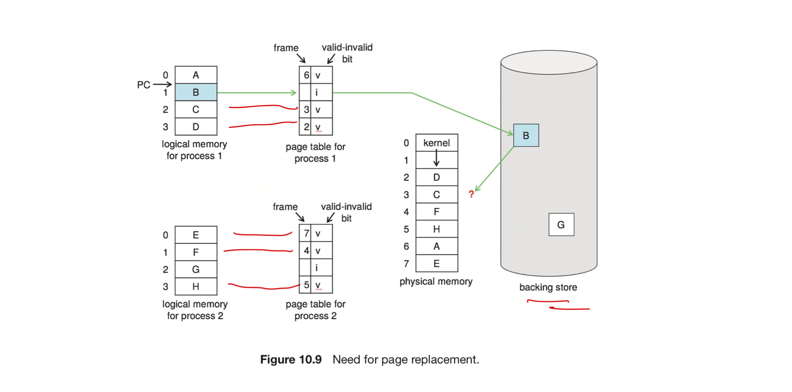

10 Pages | Lec 19 - Tues - July 21
- Section 10.4 Page Replacement
### 1. Intro (Page 2 - 4)
Over-allocating of memory manifests itself as flows
- while a process is executing, a page fault occurs
- the OS determines where the desired page is residing on disk 
  - but then finds that there are **NO Free Frames**
  - all memory is in use
  

#### Three options if no free frames to put a new page into
1. Terminate the Process
- However, demand paging is the OS attempt to improve the utilization and throughput
- User should not be aware that their processes are running on a paged system
  - paging should be logically transparent to the user => NOT the best choice
2. Swap out the process, freeing all its frames and reducing the level of multiprogramming
- However, swapping is no longer used by most OS
  - Due to the **overhead of copying ENTIRE processes** between memory and swap space
3.(BEST) Combine Page Replacement with swapping

#### Page Replacement Approach:
- If NO Frame is Free
  - we find one that is not currently being used and 
  - free a frame by writing its contents 
    - to swap space and changing the page table
    - to indicate the page is no longer in memory
- Use the freed frame to hold the page 
  - for which the process faulted

#### Modify the page-fault service routine to inlude page replacement: (Page 2)
1. Find the location of the desired page on secondary storage
2. Find a free frame:
- a. If there is a free frame, use it!
- b. If there is no free frame, use a PRA 
  - to select a **victim frame** 
    - that has been modified since it was first loaded into memory (Quiz 5 Q5)
- c. Write the **victim frame** secondary storage (if necessary);
  - change the page and frame tables accordingly
3. Read the desired page into the newly freed frame; 
  - change the page and frame tables
4. Continue the process from where the page fault occured

For 2b, If no frames are free, **TWO【2】** page transfers are required
- one for the page-out, and one for the page-in
- Overhead: this **Effectively DOUBLEs** the page-fault service time and increases the effective access time accordingly

#### Modify Bit (dirty bit)
Used to Reduce the overhead above 
- each page or frame has a modify bit associated with it in the hardware
  - the modify bit is set whenever any byte in the page is **written into**
  - indicating that the page has been **modified**
TODO:

This scheme can significantly reduce the time required to service a page fault,
- Since it reduces I/O time by one-half 
  - if the page has not been modified
#### Apply PRA in two ways
Locally: We ONLY choose **victim page** 
- from the set of pages owned by the process

Globally: Choose from ALL pages currently in memory
#### Two main problems to be sloved
- Which PRA to use? ==> the one with the lowest page-fault rage ==> effective memory access time
  - important because secondary storage I/O is so expensive that even slight improvements in demand-paging methods yield large gains in system performance
- How many frames do we allocate to each process?
- How to select frames that are to be replaced

#### Evaluation of PRA(Page 4)
Running an algorithm on a particular **reference string of memory references** 
- => computing the number of page faults

A reference string is **a sequence of memory address accesses** (read or write) that occur over a time period
- can be artificially created (random-number generator) or recorded during execution of a system
  - used to compare PRA's

To determine the number of page faults for a particular reference string and PRA
- Need to know the number of page frames available
- Obviously, as the number of frames available Increases, the number of Page Faults Decreases
  - fewer frames causes the number of page replacements to increase

### 2. The FIFO PRA (Section 10.4.2 | Page 5 - 7)
The simplest algorithm that associates with each page the time when that page was brought into memory
- when a page must be replaced, the oldest page(**victim**) still in memory is chosen.
- it is not necessary to record the time when a page is brought in

We can create a FIFO queue to hold all pages in memory
- replace the page at the head of the queue
- when a page is brought into memory
  - insert it at the tail of the queue
  
#### Advantages (Page 6)
#### Disadvantages (Page 7)
FIFO is not optimal
- Relatively Large number of page faults
- Slows down program execution
### 3. The Optimal Page Replacement Algorithm (Section 10.4.3 | Page 8 - 10)
If want to cause the **lowest number of page fault**, which page would replace when a free frame was needed?

#### Three Points (Page 10)

TOGO: Lec 20: PRA2, Lec21:Thrashing and others in VM
