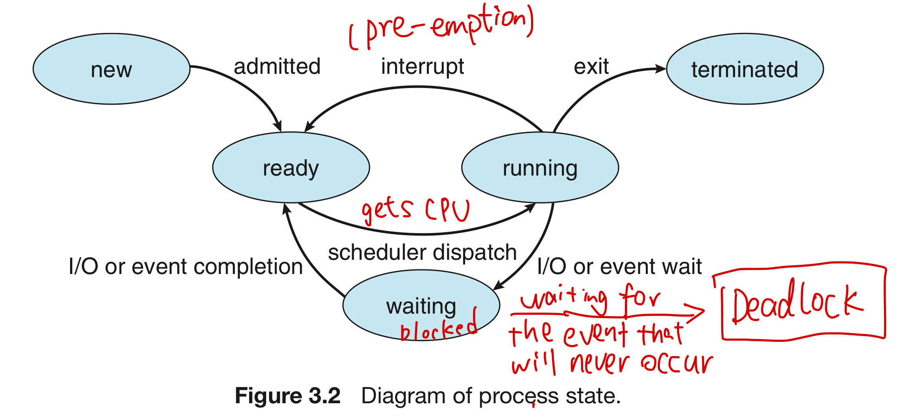

### May 26, Tues 13:30 - 14:30 (10 pages)
#### Readings: Chapter3: Proecesses - Section 3.1
---
### 1. What is a Process? 
**Fundamental building block** of modern operating systems is the notion of **process**
> A process is a program in execution, this includes:
- All programs running on behalf of users (application programs)
- Some OS functions are also implemented using processes
- A single thread of execution under control of the OS
#### 1.1 Process Details
- Much of the functionality of a modern OS is the work required to manage processes
- OS may have hundreds of processes active at the same time
  - Although only a small # are executing in a multi-core system
- Processes are not found inside the OS kernel
  - Kernel manages all processes
#### 1.2 What is NOT a Process
- A program by itself is not a process
- No 1-1 corrrespondence between programs and processes
  - there may be 10 people using emacs at the same time
    - i.e.10 **processes** running emacs, but only one copy of the emacs **program** on disk
  - there may be many programs on disk that are not executing at the present time
    - ==> these are NOT processes
  - Programs are passive entities, processes are active entities
 #### 1.3 Layout of A process in Memory (P5)

### 2. Process States (3.1.2 P6)
Modern OSes allow for more than one process to exist at the same time, and since there is usually only one processor, processes must assume different states during their lifetime: 
- Running: Instructions are currently being executed by a processor
- Blocked(Waiting): The Process is waiting for some `external` event to occur
  - e.g. I/O completion or reception of a signal
- Ready: The process is waiting to **be assigned to a processor**
- Deadlocked: waiting for an event that will never occur
  - OS must recognize this and deal with it 
### Process State Diagram (P7)

### 3. Process Control Block (3.1.3 P8-P9)
- Each process `is represented` in the operating system by a Process Control Block
  - a data structure that keep track of all the important information in a process
  - Process State
  - Program Counter: indicates the `address` of the next instruction to be executed for this process
  - CPU Registers: includes accumulators, index registers, stack pointers, and general-purpose registers, plus any condition-code information
  - CPU-Scheduling Information: a process priority, pointers to scheduling queues, and any other scheduling parameters (chapter 5)
  - Memory-Management Information: the value of the base and limit registers and the page tables, or the segment tables (Chapter 9)
  - Accounting Information: the amount of CPU and real time used, time limits, account numbers, job or process numbers...
  - I/O status Information: the list of I.O devices allocated to the process, a list of open files...

- The PCB simply serves as the repository for all the data needed to start, or restart, a process, along with some `accounting data`
### 4. Process Model of an OS (Threads P10 3.1.4)
- Single thread of control allows the process to perform `only one task at a time`
  - the user cannot simultaneously type in characters and run the spell checker
- Most Modern Operating systems have extened the process concept to allow a process to have `multiple threads` of execution and thus to perform `more than one task at a time`
  - On Multicore Systems, multiple threads can run in parallel
  - A multithreaded word processor could assign one thread to manage user input while another thread runs the spell checker
- Systems run on top of ( and supported by ) an `OS kernel`
- The kernel is responsible for the following services:
  - Creation and destruction of processes
  - CPU Scheduling, Memory Management, Device Management
  - Process Synchronization Tools
  - Process Communication Tools
- OS services provided by the kernel are invoked using system calls
